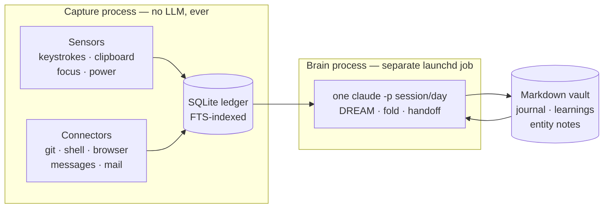

# 2ndm1nd

[](https://github.com/bayraak/2ndm1nd-runtime/actions/workflows/ci.yml)

Local-first ambient capture plus daily LLM consolidation for a personal knowledge
vault on macOS. A menu-bar app records what you do (keystrokes, clipboard, focused
windows, shell, git, browser, messages, mail) into an FTS-indexed SQLite ledger.
A separate daily "brain" job reads that ledger and maintains a markdown memory
graph inside an Obsidian-style vault.

Everything stays on the machine: SQLite for raw events, markdown for memory.
No cloud storage. The only network call is the brain's `claude -p` session.

## Two-process architecture

1. **Capture** (`2ndm1nd`, a launchd agent). Sensors and connectors append events
   to the ledger. Capture never calls an LLM; there is no model anywhere in the
   capture path. It runs and is useful even if the brain never runs.
2. **Brain** (`brain-loop.sh`, a separate launchd agent). Resumes one headless
   `claude -p` session per day, roughly hourly, to consolidate the day's events
   into the vault (journal, learnings, entity notes, a handoff letter to
   tomorrow's session). If it dies, capture is unaffected.

The Swift `Cortex` also schedules smaller solver/daily/weekly jobs, and a
`BrainCLI` (`brain`) exposes the ledger (search, spans, stats, annotations).




## Privacy guarantees, as structure

- **No LLM in the capture path.** Enforced by design: sensors write to SQLite
  only. LLM work happens in the separate brain process, in batch.
- **Excluded apps leave a presence-only marker.** For configured `never_record`
  apps (password managers, banking), sensors emit an event with no content, no
  length, and no hash. Secure input fields are blocked by the OS itself.
- **Write whitelist for the brain.** Vault writes from model output go through a
  path whitelist in code; `Atlas/Personal` and anything outside the vault are
  rejected. The brain's sandbox also read-denies credential paths.
- **Local only.** The HTTP server binds 127.0.0.1 with a bearer token stored
  0600 on disk.

## Components

- `Sources/SecondMindKit` — the library: sensors (focus context, input,
  clipboard, power), connectors (shell history, git, IDE, browser, Messages,
  Mail, Claude Code sessions), SQLite event store with FTS5, sessionizer
  (events to activity spans), Cortex (scheduled claude jobs and prompts),
  BrainServer (localhost HTTP: /now, /spans, /search, /ask), config (TOML).
- `Sources/SecondMindApp` — the `2ndm1nd` menu-bar binary and subcommands
  (`serve`, `connect`, `sessionize`, `cortex`, `eventkit`, ...).
- `Sources/BrainCLI` — the `brain` CLI over the ledger.
- `brain-loop.sh` — the daily shift runner (session lifecycle, watchdogs,
  budgets, backup, git commit of brain output).
- `*.py` — deterministic "instruments" that pre-compile evidence for the brain:
  digest, deltas, co-activation, communities, rhythm, register, timeline
  distillation, note lint, queue builder, self-test.
- `mcp/` — an MCP server exposing brain search/spans/now/ask to MCP clients.
- `raycast/` — a small Raycast extension over the local server.
- `plists/` — launchd agent templates (`__HOME__`/`__USER__` are substituted at
  install time by the Makefile).

## Build and run

Requires macOS 15+, Swift 6, and the `claude` CLI on PATH for the brain.

```bash
swift build -c release      # or: make v2-build
swift test                  # or: make v2-test
make v2-install             # install binaries + stable codesign identity
make v2-up                  # start the capture agent
make v2-brain-up            # start the daily brain runner
make v2-status              # app + ledger status
```

`make` with no target lists all targets. Configuration lives in a TOML file
(see `Config.swift` for keys and defaults; override the path with
`SECONDMIND_CONFIG`). The vault location defaults to `~/Projects/2ndm1nd`.
Capture needs Accessibility and Input Monitoring grants; some connectors need
Full Disk Access; Calendar/Reminders/Contacts are optional and prompted.

Set `SECONDMIND_AUTHOR_RE` to a regex matching your git author names/emails so
the timeline instruments can tell your commits from others'.

## Status

This is a personal system, published as-is. It is shaped by one person's vault
layout and workflow. Expect to edit paths, cluster queries, and prompts before
it fits anyone else.
