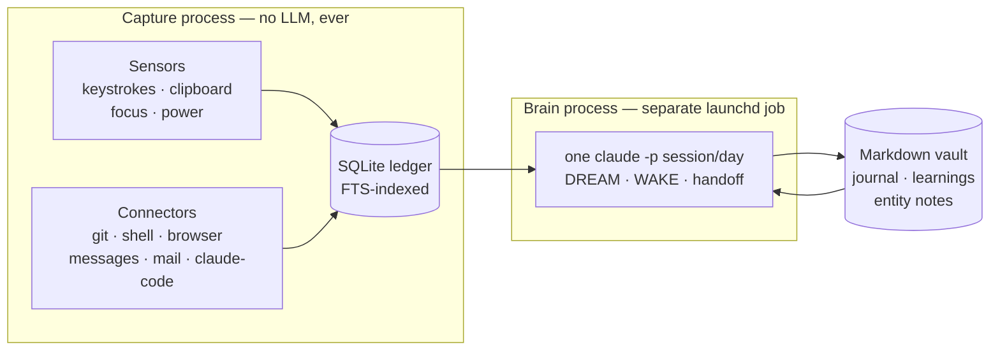

# 2ndm1nd

[](https://github.com/bayraak/2ndm1nd-runtime/actions/workflows/ci.yml)
[](LICENSE)


Local-first ambient capture plus daily LLM consolidation for a personal knowledge
vault on macOS. A menu-bar app records what you do (keystrokes, clipboard, focused
windows, shell, git, browser, messages, mail) into an FTS-indexed SQLite ledger.
A separate daily "brain" job reads that ledger and maintains a markdown memory
graph inside an Obsidian-style vault.

## Why

The premise, in the author's words: *how much it knows for you, that much it
becomes you.* A ledger that holds most of your working day is not a log file;
it is an extension of your memory, and over time an extension of you. That is
why the privacy architecture here is structural rather than promised. You would
not hand a copy of yourself to a cloud service, so nothing in this system does:
everything stays on the machine — SQLite for raw events, markdown for memory —
and the model is a *consumer* of the ledger, never a resident of the capture
path. Capture writes to disk and nowhere else; the brain reads what capture
wrote, in batch, in a separate process, under an OS sandbox. A system this
intimate has to be verifiable by its owner, so the guarantees are code paths you
can grep ([docs/privacy.md](docs/privacy.md) lists the exact commands), not
policy sentences.

## Two-process architecture

1. **Capture** (`2ndm1nd`, a launchd agent). Sensors and connectors append events
   to the ledger. Capture never calls an LLM; there is no model anywhere in the
   capture path. It runs and is useful even if the brain never runs.
2. **Brain** (`brain-loop.sh`, a separate launchd agent). Resumes one headless
   `claude -p` session per day, roughly hourly, to consolidate the day's events
   into the vault (journal, learnings, entity notes, a handoff letter to
   tomorrow's session). If it dies, capture is unaffected.

The Swift `Cortex` also schedules smaller solver/daily/weekly jobs, and a
`BrainCLI` (`brain`) exposes the ledger (search, spans, stats, annotations).



Deep dive: [docs/architecture.md](docs/architecture.md). Two companion
documents cover the design's economics and its governance:
[docs/token-economy.md](docs/token-economy.md) (how deterministic
pre-filtering, gates and bounded budgets keep model spend small) and
[docs/self-evolution.md](docs/self-evolution.md) (what the brain may rewrite
about itself, and the hard boundary it cannot cross).

## What it looks like after a year of running

Numbers from the author's instance (one person, one Mac), for scale — not a
benchmark: the ledger is **~80 MB of SQLite** holding **~123,000 events**. The
nine most common event kinds:

| kind | count | source |
|---|---:|---|
| context-snapshot | 33,670 | focus sensor (which window, which chat, which project) |
| activity-window | 28,874 | input sensor (typed text + activity metrics) |
| visit | 27,092 | browser history connector |
| app-activated | 15,535 | focus sensor |
| qa-exchange | 9,205 | input sensor + Claude Code connector (question/answer pairs) |
| commit | 2,802 | git connector |
| message | 2,608 | mail connector |
| clipboard-changed | 2,213 | clipboard sensor |
| command | 800 | shell-history connector |

<details>
<summary>Ledger schema (real, from the running instance)</summary>

```sql
CREATE TABLE "events" ("id" INTEGER PRIMARY KEY AUTOINCREMENT, "ts" DOUBLE NOT NULL, "source" TEXT NOT NULL, "kind" TEXT NOT NULL, "app" TEXT, "text" TEXT, "payload" TEXT NOT NULL, "spanId" INTEGER);
CREATE TABLE "spans" ("id" INTEGER PRIMARY KEY AUTOINCREMENT, "t0" DOUBLE NOT NULL, "t1" DOUBLE NOT NULL, "activity" TEXT NOT NULL, "app" TEXT, "project" TEXT, "title" TEXT, "entities" TEXT, "evidence" TEXT, "day" TEXT NOT NULL);
CREATE VIRTUAL TABLE events_fts USING fts5(text, content='events', content_rowid='id', tokenize='unicode61');
-- plus insert/delete triggers keeping the FTS index in sync, and indexes on ts/source/app/day
```

</details>

## Quickstart

Requires macOS 15+, Swift 6 (Xcode Command Line Tools), and — only for the
brain — the `claude` CLI with a Claude subscription. Capture works without it.

```bash
git clone https://github.com/bayraak/2ndm1nd-runtime
cd 2ndm1nd-runtime
swift build -c release   # builds the `2ndm1nd` app and the `brain` CLI
swift test
```

From there, [docs/setup.md](docs/setup.md) covers the parts that need care on
macOS: a stable code-signing identity (so TCC grants survive rebuilds),
rendering the launchd plist templates in `plists/` (`__HOME__`/`__USER__` are
substituted at install time), the permission grants each sensor needs and why,
and how to run capture entirely without the brain.

## Privacy model

- **No LLM in the capture path.** Sensors and connectors write to SQLite only.
  Model work happens in the separate brain process, in batch.
- **Excluded apps leave a presence-only marker.** For configured `never_record`
  apps (password managers, banking), the focus and clipboard sensors emit a
  marker with no content, and the input sensor emits nothing at all. Secure
  input fields (password boxes) are dropped at the event tap.
- **The brain is caged by the kernel, not by its prompt.** Every model session
  runs under a `sandbox-exec` profile that makes the vault read-only except the
  memory directories the brain owns, and read-denies credential paths outright.
- **Local only.** The HTTP server binds 127.0.0.1 with a bearer token stored
  0600 on disk. The only network calls are the brain's `claude` session and a
  connectivity probe before starting one.

Full table of what every sensor stores and never stores, plus the grep commands
to verify each claim against this repo: [docs/privacy.md](docs/privacy.md).

## Model provider

The brain speaks to exactly one provider today: the `claude` CLI, headless
(`claude -p`), authenticated by subscription. That is a deliberate seam, not an
assumption baked through the codebase — the brain is the only component that
talks to a model at all, so supporting another vendor's CLI/API, or a fully
local model (which would make the whole system offline), means implementing
that one seam. What a provider has to satisfy is documented in
[docs/architecture.md](docs/architecture.md#the-provider-seam); it is the
most-wanted contribution ([CONTRIBUTING.md](CONTRIBUTING.md)).

## Components

- `Sources/SecondMindKit` — the library: sensors (focus context, input,
  clipboard, power), connectors (shell history, git, IDE, browser, Messages,
  Mail, Claude Code sessions, EventKit), SQLite event store with FTS5,
  sessionizer (events to activity spans), Cortex (scheduled claude jobs and
  prompts), BrainServer (localhost HTTP: /now, /spans, /search, /ask),
  config (TOML).
- `Sources/SecondMindApp` — the `2ndm1nd` menu-bar binary and subcommands
  (`serve`, `connect`, `sessionize`, `cortex`, `eventkit`, ...).
- `Sources/BrainCLI` — the `brain` CLI over the ledger.
- `brain-loop.sh` — the daily shift runner (session lifecycle, watchdogs,
  budgets, backup, git commit of brain output).
- `*.py` — deterministic "instruments" that pre-compile evidence for the brain:
  digest, deltas, co-activation, communities, rhythm, register, timeline
  distillation, note lint, queue builder, self-test.
- `mcp/` — an MCP server exposing brain search/spans/now/ask to MCP clients.
- `raycast/` — a small Raycast extension over the local server.
- `plists/` — launchd agent templates (`__HOME__`/`__USER__` are substituted at
  install time).

## Status

This is a personal system, published as-is. It is shaped by one person's vault
layout and workflow. Expect to edit paths, cluster queries, and prompts before
it fits anyone else. Issues and questions are welcome; so are contributions
that respect the one invariant (see [CONTRIBUTING.md](CONTRIBUTING.md)).
Known limits and where the project is headed: [ROADMAP.md](ROADMAP.md).

## Agent skill

The repo ships a [SKILL.md](SKILL.md) so an AI agent can operate the system
without re-deriving it from the docs: build, the TCC-safe install path,
starting/stopping capture and the brain, querying the ledger, and the spend
dials. Point an agent at the repo and it picks the skill up, or copy the repo
folder into your agent's skills directory (e.g. `~/.claude/skills/`).

## License

[MIT](LICENSE).
