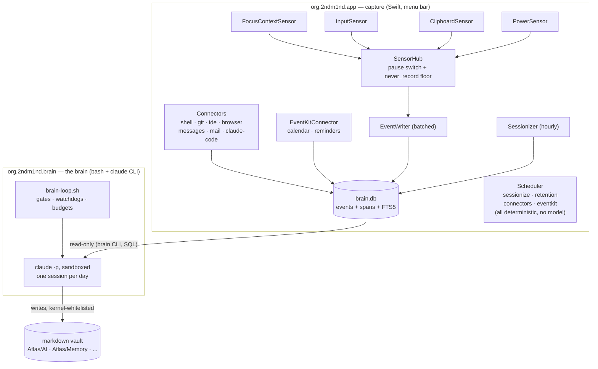
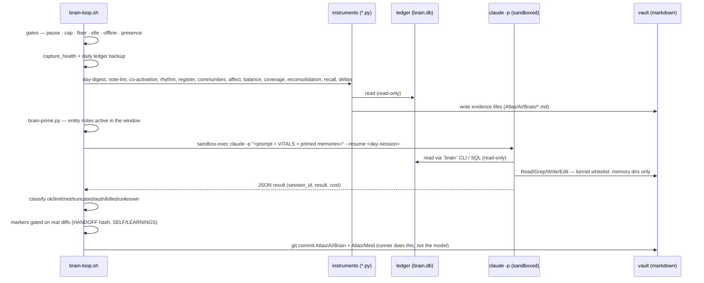
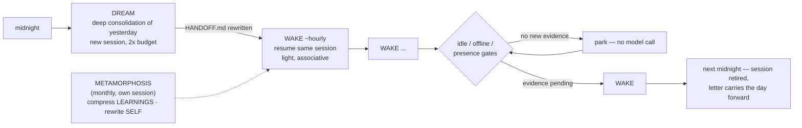

# Architecture

Two processes, one ledger, one vault. This document walks the real code; file
references are to this repository. Companion documents:
[token-economy.md](token-economy.md) on how this design keeps model spend
small, and [self-evolution.md](self-evolution.md) on what the brain may change
about itself and where the hard boundary sits.

## Why two processes

Capture (`2ndm1nd`, launchd agent `org.2ndm1nd.app`) and the brain
(`brain-loop.sh`, launchd agent `org.2ndm1nd.brain`) are separate launchd jobs
with separate lifecycles on purpose:

- **Capture must never depend on the model.** If the brain crashes, hits a
  usage limit, loses the network, or is simply never installed, events keep
  landing in the ledger. The brain plist says this in its own comment:
  "Separate from the capture app so capture never depends on the brain."
- **The model must never sit in the capture path.** Sensors fire on every
  keystroke; a model call there would be a latency, cost, and privacy disaster.
  The capture process contains no scheduled code path that invokes a model
  (see [the no-LLM boundary](#the-capture-path-and-the-no-llm-boundary) below).

## The capture path and the no-LLM boundary

`SensorHub` (Sources/SecondMindKit/Sensors/SensorHub.swift) starts the four
sensors, owns the shared buffered `EventWriter`, and enforces two things in one
place: the menu-bar pause switch, and the `never_record` floor
(`isNeverRecordApp` / `isNeverRecordPath`, configured in `SMConfig`).

The capture process makes zero model calls on any scheduled path. The app
binary does link `ClaudeRunner` for three *user-initiated* surfaces — the
`2ndm1nd cortex <tier>` subcommand, the `claude-smoke` test commands, and the
local server's `POST /ask` — but nothing the Scheduler runs ever touches it
(`wireJobs()` in Sources/SecondMindApp/main.swift registers exactly four jobs:
sessionize, retention, connectors, eventkit — all deterministic). The sensors,
connectors, event store, sessionizer and scheduler have no reference to
`ClaudeRunner` at all; docs/privacy.md gives the grep to confirm it.

### Sensors

**FocusContextSensor** (Sensors/FocusContextSensor.swift). Fires on app
activation and on a 30-second heartbeat while the same window stays focused.
Records: bundle id, app name, focused-window title (via Accessibility), and the
app-family-specific meaning extracted from the title — which chat, which
terminal cwd, which project/file, which browser tab — plus attribution fields
(`to`, `thread`, `channel`). Heartbeat snapshots are deduped when nothing
changed. What it never records: anything from a `never_record` app. For those
it emits a `privacy-blocked-presence` event carrying only the bundle id — no
title, no content.

**InputSensor** (Sensors/InputSensor.swift). A listen-only `CGEventTap` over
keyDown, left/right mouse down, and scroll (deliberately not mouse movement).
It reconstructs the text you actually type — layout-aware, backspace-corrected
— and flushes per-app aggregation windows (every 30 s, on app switch, or at a
4,000-character cap) as `activity-window` events: typed text plus keystroke
count, backspace ratio, clicks, scroll, chars/minute. When a reply starts in a
terminal or chat, it snapshots the on-screen context via Accessibility *before*
the reply lands (terminal scrollback, or a bounded walk of the chat window's
AX tree) and emits a `qa-exchange` event: `Q: <on-screen context> / A: <your
literal reply>`, raw, with no model involved. What it never records:
secure-input fields (password boxes) — `IsSecureEventInputEnabled()` is checked
in the tap callback and the event is dropped before any processing — and
`never_record` apps, for which the whole window is discarded at flush time:
no text, no counts, nothing emitted.

**ClipboardSensor** (Sensors/ClipboardSensor.swift). Polls
`NSPasteboard.changeCount` at 0.7 s. Stores copied text verbatim (first 10,000
characters) with length and SHA-256, tagged with the frontmost app. What it
never records: a copy made while a `never_record` app is frontmost produces a
presence marker only — no content, no length, no hash, because even a length
or a hash of a copied password is a fingerprint (the code says exactly this).
Non-text clipboard content produces a `clipboard-nontext` marker.

**PowerSensor** (Sensors/PowerSensor.swift). Sleep, wake, screensaver,
screen-lock, session switches. Event kinds only, no content. This is what lets
the sessionizer and the brain tell an idle gap from a closed lid.

### Connectors

`Connectors` (Sources/SecondMindKit/Connectors.swift) are scheduled pull
sources. Each reads a delta since its last run and persists its own cursor in
`connector-state.json` under app data, so re-runs never duplicate:

| connector | reads | cursor / dedup |
|---|---|---|
| shell | `~/.zsh_history`, `~/.bash_history` | byte offset per file (first run: last ~20 KB); handles rotation |
| git | local repos under the project roots (depth ≤ 4, prunes `node_modules`, hidden dirs, `Library`, `Pods`) | `git log --branches --no-merges --since=14.days.ago`, deduped by full SHA (last 10,000 kept) |
| ide | VS Code / Cursor `workspaceStorage/*/workspace.json` | file mtime > last run |
| browser | Chrome / Arc / Brave `History` SQLite (copied first, WAL sidecar included, because the live DB is locked) | `visits.visit_time` high-water mark per browser |
| messages | `~/Library/Messages/chat.db` (needs Full Disk Access) | `message.ROWID` high-water mark |
| mail | `~/Library/Mail` `.emlx` files + Envelope Index metadata (needs Full Disk Access) | mtime watermarks `mail_hi`/`mail_lo`; bounded backfill batches of 800 |
| claudeCode | `~/.claude/projects/*/*.jsonl` session logs | message timestamp > last run; skips the brain's own sessions by sentinel |

Two of these deserve a note. The **mail** connector does no parsing, OCR, or
distillation: it copies the raw `.emlx` and its attachments verbatim to a
brain-readable directory (Mail's own storage is FDA-gated, so the sandboxed
brain cannot read it in place) and stores paths plus cheap From/Subject/Date
from the Envelope Index. The **claudeCode** connector is the clean Q/A source
(your real prompts to your agents, paired with what the agent said just
before); it refuses to ingest the brain's own `claude -p` transcripts — a
session whose first real user turn starts with the brain's sentinel token is
skipped, which closes the feedback loop deterministically, with no model call.

`EventKitConnector` (EventKitConnector.swift) adds calendar and reminders
hourly, but only when the system grant already exists — the scheduled path
never prompts. Contacts seeding is manual (`2ndm1nd eventkit`) because it can
create many vault stubs and should be a deliberate act.

### EventStore — the ledger

Sources/SecondMindKit/EventStore.swift. One SQLite file
(`~/Library/Application Support/2ndMind/brain.db`), GRDB, WAL mode, so the
`brain` CLI and the HTTP server can read while the app writes. Two tables plus
an FTS index:

- `events` — timestamp, source, kind, app, searchable `text`, JSON `payload`.
- `spans` — activity spans (t0/t1, activity, app, project, entities, evidence,
  day) produced by the sessionizer.
- `events_fts` — FTS5 (`unicode61`) over `events.text`, kept in sync by
  insert/delete triggers.

Writes go through an actor (`EventWriter`) that batches up to 200 events or
1 second, whichever comes first. Retention: raw events older than 365 days are
pruned nightly; spans are small and kept forever. `rawQuery` gives the brain
CLI guarded read-only SQL (`SELECT`/`WITH` only).

### Sessionizer

Sources/SecondMindKit/Sessionizer.swift folds the day's focus/input events into
human-meaning spans: a span is a maximal run where the *activity*
(coding/chatting/browsing, derived from app family) stays stable with gaps
shorter than `idle_close_s` (default 90 s). Terminal↔IDE switches stay one
"coding" span. Spans under 30 s with no project or entity are dropped as noise.
Output goes to SQLite and to `Atlas/AI/spans/<date>.md` — the markdown surface
the brain and the human both read. Rebuilds are idempotent per day.

### Scheduler

Sources/SecondMindKit/Scheduler.swift is an in-app actor with a 60-second tick
(so a laptop that slept catches up on wake). The app registers four jobs, all
deterministic, none of which invokes a model:

1. **sessionize** — hourly, rebuilds today's spans.
2. **retention** — daily at 03:00, prunes events older than 365 days.
3. **connectors** — hourly, runs all pull connectors.
4. **eventkit** — hourly, calendar/reminders when already granted.

Each due job runs in its own task so a hung job cannot stall the others, with
an overlap guard per job name.

## The brain

### One session per day

`brain-loop.sh` is a shift runner, not a cron: a KeepAlive launchd agent whose
loop keeps **one** `claude -p` session id per day and resumes it every cycle
(`--resume <id>`), so context accumulates across the whole day. A new day
starts a fresh session whose first cycle is the **DREAM** — the deep
consolidation of yesterday. Continuity across days is the **HANDOFF letter**:
the DREAM's final act is rewriting `HANDOFF.md`, and the next day's boot prompt
includes it ("grade its predictions, answer its questions").

Cycle kinds, decided at the top of each loop iteration:

- **DREAM** — first successful deep cycle of the day. Gets 2× the normal time
  budget. The day is marked consolidated only when the cycle exits cleanly
  *and* the HANDOFF file hash actually changed — the runner gates completion
  on the work, not on the exit code.
- **DREAM RESUME** — a severed DREAM (machine slept mid-stream) left a session
  id but no completion marker; the runner resumes that conversation rather than
  starting over.
- **WAKE** — light associative cycles, roughly hourly, resuming the day's
  session.
- **METAMORPHOSIS** — at most monthly, in its own session: compress
  `LEARNINGS.md`, rewrite `SELF.md`, advance the ontology. Triggered by real
  pressure (file size caps, staleness) and gated on producing an actual diff.

### Gates: most cycles never call the model

Before any `claude` invocation, the runner checks, in order: a pause file; the
daily session cap; a relaunch floor (persisted across restarts — never two
cycles closer than `SECONDMIND_MIN_RELAUNCH`); the **idle gate** (fewer than
`SECONDMIND_IDLE_MIN` new ledger events since the last successful cycle → no
call, recheck in 15 minutes); the **offline gate** (a transport-level probe of
`api.anthropic.com` — any HTTP response counts as reachable, only DNS/refused/
timeout parks the runner); and a **presence gate** for deep cycles (on battery
with no input for 15 minutes, a DREAM is deferred rather than launched into a
machine about to sleep). Quiet stretches therefore cost nothing.

The deterministic half of the health check runs even on skipped cycles:
`capture_health` kickstarts the capture agent if it died and keeps Mail.app
alive (mail capture depends on Mail fetching), and `backup_ledger` takes one
`sqlite3 .backup` of the ledger per day (retaining seven, honestly labeled in
the code as same-disk — it defends against corruption, not a dead drive).

### One cycle, end to end

Details worth knowing, all in brain-loop.sh:

- **VITALS.** Every prompt carries a deterministically computed health block:
  SELF.md size against its budget, LEARNINGS growth, open proposals awaiting
  the human, DREAM coverage over 14 days, backup age, unresolved attribution
  count. Rationale in the code: "a rail the model cannot see is not a rail."
- **Priming and pre-digestion.** `brain-prime.py` injects the entity notes
  mentioned in the unread window; the instrument scripts pre-compile the
  window's evidence so the model spends its budget on cognition, not
  exploratory SQL.
- **Watchdog on awake-clock.** The per-cycle time budget counts awake seconds,
  not wall seconds — each 15 s poll bills its observed delta, and any delta
  over 60 s is read as "the Mac was asleep" and billed at 60 s. A sleeping
  machine cannot consume a consolidation's budget. TERM at the cap, SIGKILL
  60 s later.
- **Failure classification and backoff.** Results are classified
  ok/limit/net/truncated/auth/killed/unknown from exit code, the JSON's
  `is_error`, and the result text; unknown failures are logged verbatim. A
  cost-gated refund hands the day's slot back when no reasoning happened, and
  an escalating backoff keyed to the consecutive-failure streak (6-hour
  ceiling) is the rail that does not depend on recognizing the error string.
- **Session hygiene.** The runner identifies its own session three ways — a
  sentinel token in the boot prompt, the exact child PID, and a PID-tree kill —
  and never uses a name-based pkill, so other projects' `claude -p` sessions
  are untouchable by construction. `ANTHROPIC_API_KEY` is unset at the top of
  the script; subscription auth is the only path.
- **Provenance.** After a clean cycle the *runner* — not the model — commits
  `Atlas/AI/Brain` and `Atlas/Mind` to git, pathspec-scoped. Compression is
  recoverable, the prediction board is tamper-evident, and the model cannot
  skip or narrate this step.

### A day in the life

### The sandbox: enforcement is the kernel

Every model session — from the Swift runner and from brain-loop.sh alike —
runs under `sandbox-exec` with a profile generated by
`ClaudeRunner.ensureSandboxProfile` (Sources/SecondMindKit/ClaudeRunner.swift).
The profile is default-allow for claude's own housekeeping, then:

- deny writes to the whole vault; allow back only the memory directories the
  brain owns (`Atlas/AI`, `Atlas/Memory`, `Atlas/Projects`, `Atlas/People`,
  `Atlas/Organizations`, `Atlas/Mind`, `Atlas/Ideas`);
- re-deny the sensitive paths after the allow-backs so they win
  (`never_record_paths`, the installed runner and binaries, the LaunchAgents
  directory, the runner's own state files — the model cannot edit its own
  budget enforcement);
- read-deny credentials outright: `~/.ssh`, `~/.aws`, gcloud config,
  `~/.cloudflared`, quarantined password notes, and the vault's MCP env file.
  The brain is mandated to explore the disk read-only for evidence, so secrets
  are made unreadable, not merely unwritable.

The sandbox is inherited by everything the model spawns, Bash children
included. This is why the model can hold real `Write`/`Edit` tools and still
be unable to touch anything outside its own memory: the guarantee has no code
path around it.

The Swift `Cortex` (Cortex.swift) predates the real-tools approach and keeps a
second, code-level whitelist for its tiers: the model proposes file updates as
`<<<WRITE path>>>` blocks and `applyWrite` applies them only inside
`writeWhitelist` directories — vault-relative, no traversal, markdown only.

### The provider seam

The brain supports exactly one provider today: the `claude` CLI, invoked
headless. There are two call sites, and together they define what a second
provider would have to satisfy:

1. **Sources/SecondMindKit/ClaudeRunner.swift** — used by the Cortex tiers,
   the smoke tests, and `POST /ask`. It discovers the binary
   (`~/.local/bin/claude` first, PATH as a logged fallback), feeds the prompt
   via stdin (never argv), passes `--output-format text`, replaces the child
   environment wholesale with `HOME`/`USER`/`LOGNAME`/`PATH` (so no API key
   can leak in), wraps the process in the sandbox profile, retries once after
   30 s, and detects usage-limit responses by message text because they can
   arrive with exit code 0.
2. **brain-loop.sh** — the shift runner invokes the CLI directly with
   `--output-format json`, reads `session_id` back from the JSON, resumes the
   day's conversation with `--resume <id>`, and classifies failures from the
   exit code plus `is_error` plus the result text.

So a provider, concretely, must offer: a headless one-shot invocation that
takes a prompt on stdin and returns text (Swift side) or JSON with a session
id (runner side); **session resume by id** — the day-long accumulating
conversation is the brain's working memory, not an optimization; distinguishable
failure classes (exit codes and recognizable limit/auth/network error text);
and the ability to run as a sandboxed subprocess. There is no provider
protocol in the code today — adding one means abstracting these two call
sites, and that is the most-wanted contribution (see CONTRIBUTING.md and
ROADMAP.md). A fully local model behind this seam would make the entire system
offline.

## The Python instruments

Deterministic evidence compilers, run before each cycle (and by `make`
targets). They read the ledger and the vault, and write markdown evidence files
into `Atlas/AI/Brain/` for the model to read. None of them calls a model. The
three that do the heaviest lifting:

- **reconsolidation.py** — finds memory drift mechanically: entities active in
  the last 7 days of the ledger whose vault note hasn't been touched in ≥14
  days ("stale-but-alive", ranked by hits × age), and present-tense state
  claims in `MODEL.md` older than 12 months, due for re-verification. The
  brain revisits the top items each DREAM.
- **co-activation.py** — Hebbian edge strength for the memory graph. For every
  pair of entities it counts co-occurrence per ledger day and per shared note,
  corrects for base frequency with normalized PMI, and emits two lists:
  strongly associated pairs with no explicit link yet, and existing links with
  near-zero association (candidate spurious edges). It is evidence only — the
  brain decides which edges to draw or prune; the script never writes links.
- **communities.py** — clusters discovered, not declared: deterministic label
  propagation over the real edge set (explicit `[[links]]` plus strong PMI
  pairs), naming each community after its highest-degree hub. Writes an
  evidence file and stable color groups into Obsidian's `graph.json`, so the
  graph's colors follow its actual structure.

The rest, briefly: `day-digest.py` compiles the unread window's evidence;
`deltas.py`, `rhythm.py`, `register.py`, `affect.py`, `balance.py`,
`coverage.py`, `recall.py` each measure one dimension (change, temporal
rhythm, writing register, tone, work/life balance, capture coverage,
memory recall); `note-lint.py` maintains a quality queue over memory notes;
`queue-builder.py` mines entity candidates from deep evidence;
`brain-prime.py` selects the notes to prime a cycle with;
`timeline-distill.py` rebuilds deep history from git and mail (this is where
`SECONDMIND_AUTHOR_RE` distinguishes your commits from others');
`selftest.py` is a regression battery over all instruments, run weekly by the
runner and failing loudly.

## The local surface

`BrainServer` (BrainServer.swift) is a dependency-free HTTP server on
`127.0.0.1:<port>` (default 4517), bearer-token authenticated (token generated
once, stored 0600 in app data). `GET /now`, `GET /spans`, `GET /search` are
reads over the vault and ledger; `POST /ask` is the one user-initiated model
call in the app process, running the on-demand Cortex tier read-only. The
`mcp/` server and the `raycast/` extension are thin clients over this server
and the `brain` CLI.
